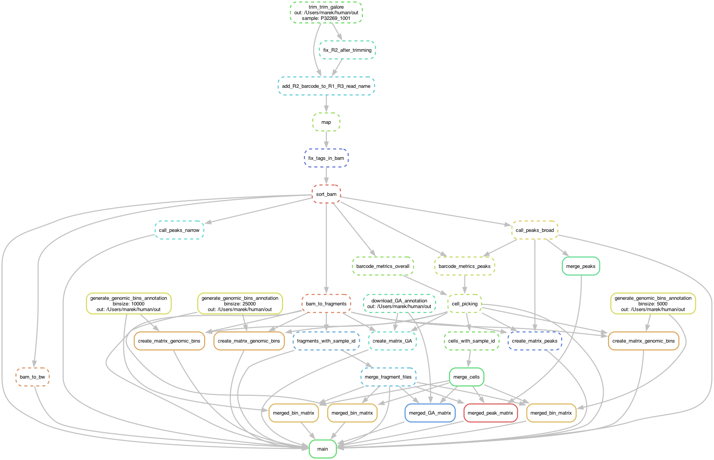

# Pipeline for cellranger free mapping of scCUT&Tag/nano-CT data

### 1. Adjust the paths in config.yaml to your fastq files

R3 fastq files should be 16bp == single-cell barcode (either single-modality data or multimodal data after demultiplexing)

R1 and R2 read lenghts can be variable (36bp or 50bp)

### 2. Install dependencies (conda environment or other)

### 3. Run the pipeline (should run localy on a macbook with 32GB memory or on a cluster)
```snakemake --snakefile scCnT_cellranger_free_pipeline/workflow/Snakefile.smk --cores 8 --rerun-incomplete -p --configfile scCnT_cellranger_free_pipeline/config.yaml```

###  Dependencies:
```
trim_galore
bwa
samtools 
bedtools
sinto #https://github.com/timoast/sinto
bgzip
tabix
deeptools
macs2
R
f2m #https://github.com/stuart-lab/f2m
Python and R packages (TODO)
```

### 4. Pipeline flowchart
